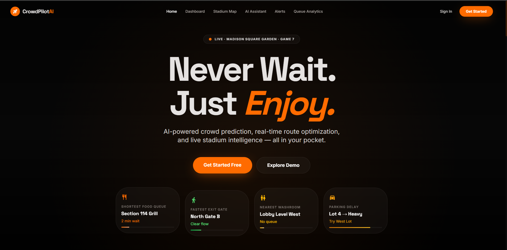
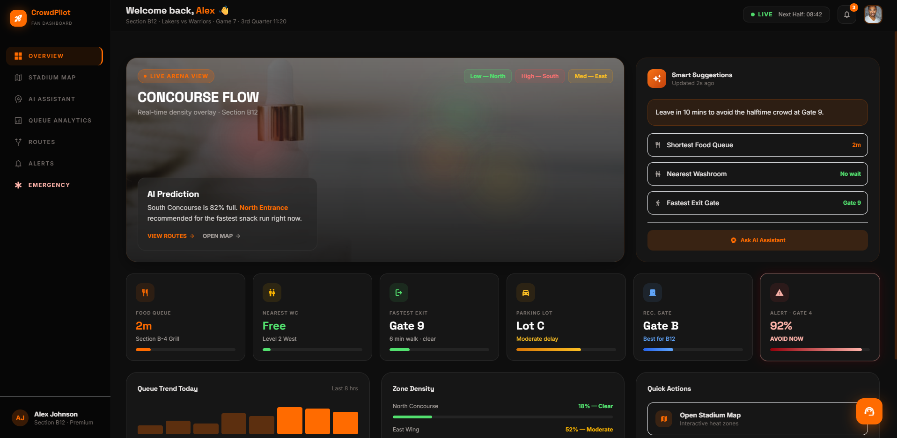
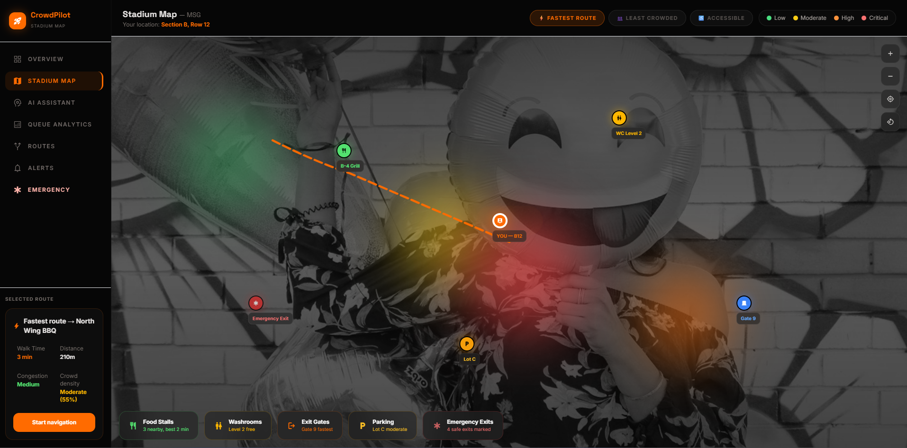
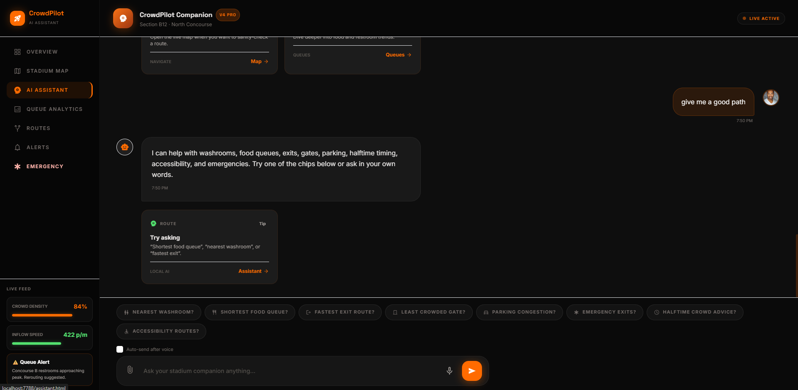
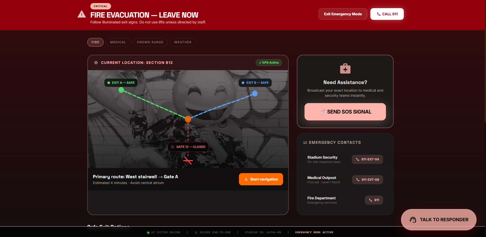

# CrowdPilot AI
> "Smarter Stadium Experiences with AI-Powered Crowd Intelligence"

CrowdPilot AI is a premium AI-powered stadium assistant that helps attendees navigate large sports venues, reduce waiting times, avoid crowds, find the best routes, and receive emergency alerts in real time.


---

## 📌 Problem Statement
Attending large stadium events is often accompanied by a series of frustrating logistical challenges:
* **Long queues:** Waiting extensively for food and merchandise.
* **Crowd congestion:** Navigating through densely packed concourses.
* **Difficulty finding facilities:** Wasting time searching for exits, washrooms, and food stalls.
* **Parking delays:** Struggling to find the right parking lot or exit strategy post-game.
* **Lack of real-time guidance:** Stadium signage is static and cannot adapt to live conditions.
* **Safety concerns:** Confusion and panic during critical emergency scenarios like medical emergencies or fire evacuations.

## 🚀 Solution Overview
CrowdPilot AI directly solves these friction points by providing an intelligent, real-time companion in the palm of your hand:
* **Real-time crowd monitoring:** Live visual heatmaps indicating high-density areas.
* **Queue analytics:** Wait times and flow optimization across stadium facilities.
* **Route optimization:** Pathfinding for the fastest, least crowded, and accessible paths.
* **AI assistant:** A built-in chat companion to instantly answer context-specific questions.
* **Emergency guidance:** A dedicated, high-contrast critical interface with safe evacuation routes and direct SOS functionality.
* **Personalized recommendations:** Tailoring the experience based on your specific seat location, accessibility needs, and category preferences.

---

## 🌟 Why CrowdPilot AI is Different
Unlike generic mapping apps, CrowdPilot AI is purpose-built for the ultra-dense, fast-moving environment of an active stadium. It doesn't rely solely on static venue maps; instead, it dynamically updates based on flow patterns and anticipated halftime rushes. Additionally, its offline-first architecture allows vital emergency and routing functions to operate even when the primary cellular networks are jammed by tens of thousands of fans.

---

## ✨ Key Features

- **Live Crowd Heatmap:** An interactive stadium map indicating real-time crowd densities for various concourses and zones.
- **Queue Analytics:** Detailed wait-time estimates and historical flow trends for food stalls, washrooms, merchandise, and parking.
- **Route Recommendations:** Smart pathfinding allowing fans to choose the fastest, least crowded, or most accessible route to their destination.
- **AI Assistant:** Seamless chat experience, enhanced with Google Gemini capabilities, capable of providing situational advice.
- **Alerts & Notifications:** A dedicated notification center featuring live alerts categorized by severity (Critical, Warning, Info).
- **Emergency Mode:** Instantly toggles the app into a high-visibility critical state with actionable evacuation vectors and responder communication.
- **Profile & Personalization:** Customization hub managing saved routes, accessibility settings, and API integrations.
- **Mobile Responsive Design:** Deeply integrated responsive layouts using Tailwind CSS for an optimal experience across all device sizes.
- **Demo Mode Simulations:** Built-in simulation engines simulating real crowd surges, data spikes, and alerts for demonstration purposes.

---

## 🛠️ Tech Stack

**Frontend:**
* HTML5
* Tailwind CSS
* JavaScript (Native ES Modules)
* `shared.css` (Premium Design Tokens & Keyframes)
* `shared.js` & `polish.js` (Core utilities & UI orchestrators)

**Data Layer:**
* Static JSON files for dynamic state injection
* `localStorage` for robust, persistent client-side state management

**Core API Integrations:**
* Google Maps API (Native vector projection & custom localized interior pathfinding)
* Firebase V9 Modular SDK (Authentication & real-time Firestore persistence mesh)
* Google Gemini API (For live, unscripted AI context)

**Future Horizon:**
* Service Worker / Offline Support (For resilience on spotty stadium networks)
* Push Notifications via FCM

---

## 📁 Folder Structure
```text
crowdpilot-ai/
├── index.html           # Landing Page
├── signin.html          # Onboarding / Sign In
├── dashboard.html       # Fan Dashboard
├── map.html             # Interactive Stadium Map
├── assistant.html       # AI Assistant Companion
├── alerts.html          # Notification Center
├── queue.html           # Flow & Wait Analytics
├── routes.html          # Route Recommendations
├── profile.html         # User Settings & Profile
├── emergency.html       # Emergency Safety Mode
├── shared.css           # Core Design System
├── shared.js            # Shared JS Utilities
├── polish.js            # UI/UX Enhancements
├── data/                # Simulated live feeds (crowd, alerts, queues)
├── docs/                # Technical documentation and QA protocols
├── services/            # API wrappers for Google integrations
├── tests/               # Lightweight core logic verification scripts
└── README.md            # Project Documentation
```

---

## 🏁 How to Run Locally

To test the platform, you will need a basic local web server to bypass CORS restrictions for module loading and JSON fetching.

1. **Clone the repository:**
   ```bash
   git clone <repository_url>
   cd crowdpilot-ai
   ```
2. **Open the terminal** in the project directory.
3. **Run a local Python HTTP server:**
   ```bash
   python -m http.server 5500
   ```
4. **Open in browser:**
   Navigate to [http://localhost:5500](http://localhost:5500).

---

## 🧭 Demo Flow

For judges evaluating this project, follow this recommended walkthrough:

1. **Landing Page:** Explore the initial marketing and value proposition screens.
2. **Onboarding:** Click "Get Started", navigate the multi-step seat and preference selection logic, and save.
3. **Dashboard:** Observe the live data tickers, wait time cards, and regional heatmap updating dynamically.
4. **Map:** Zoom, pan, and filter the interactive SVG map to view routing and POIs.
5. **Queue Analytics:** Sort and filter the data to find the shortest food lines.
6. **Routes:** Generate a path to an exit or washroom, utilizing the step-by-step guidance.
7. **Assistant:** Ask about the "shortest food queue" and review the custom cards generated.
8. **Emergency Mode:** Activate via the dashboard action button to view the simulated evacuation paths and SOS toasts.
9. **Profile:** Update settings, explore accessibility toggles, and (optionally) enter a Gemini API Key.

---

## 🤖 Google Services Used / Planned

- **Gemini API:** Supported client-side integration for intelligent conversational intelligence.
- **Firebase Auth & Firestore:** Fully active! Drives identity generation, and transparently replicates user demographic onboarding choices up to the cloud.
- **Google Maps API:** Fully dynamic interactive layer bypassing standard Directions Service to allow Native Custom Bezier Polyline routing through unmapped enclosed spaces.
- **Browser Notifications API:** Utilized locally for background event alerting.
- **Web Speech Recognition API:** Embedded into the AI Assistant for hands-free voice querying.

---

## 🏗️ Architecture Section

The application is built completely on modular, vanilla web technologies ensuring blazing-fast execution without framework overhead:

**Frontend Pages `→` JS Modules `→` Modular API Services `→` Native Google Architecture**

Every page independently loads `shared.css` and its specific `.js` module. By executing an isolated dynamic `.env` scraper securely over a static file server, CrowdPilot injects tokens to dynamically construct Google Maps Heatmap Visualizations, parse SVG mock paths into Math-based Bezier arrays mapping over Native Polylines, and persist user state continuously to Firebase without relying on bulky bundlers like Webpack or Vite. 


---

## 🧗 Challenges Faced During Development

- **Context Preservation Without a Backend:** Building a cohesive user journey across 10 separate HTML pages without a traditional backend database. We solved this by creating a robust `localStorage` abstraction layer in `shared.js` to reliably persist and sync onboarding choices, API keys, and notification triggers.
- **Simulating Live Telemetry:** Creating the "feel" of a live stadium (moving queues, crowd surges, dynamic alerts) entirely client-side. We engineered a randomized probability loop in our JS modules that continually adjusts variables based on JSON seed data.
- **Designing for High-Stress Scenarios:** During the "Emergency Mode" development, ensuring that UI elements bypassed standard aesthetic choices and transitioned into extremely clear, high-contrast, accessible state required meticulous CSS tuning.
- **Responsive Interactive Mapping:** Ensuring the absolute positioning of the map pins and dynamically rendered SVG paths accurately scaled down from desktop resolutions to 375px wide mobile device screens without breaking standard interactions.

---

## 🔮 Future Improvements

- **Live Gemini assistant:** Expanding context awareness and memory matching.
- **Voice assistant:** Bidirectional text-to-speech for accessible, screen-less engagement.
- **Push notifications:** Migrating localized toasts to true push notifications via FCM.
- **Offline mode:** Full PWA service-worker architecture for offline resilience.
- **Live backend:** Syncing actual stadium turnstile and facility telemetry.
- **QR ticket integration:** Auto-determining user seat locations upon scanning in.
- **Seat-level navigation:** Turn-by-turn interior wayfinding using BLE beacons.

---

## 📸 Screenshots Section

### Landing Page


### Dashboard


### Map


### Assistant


### Emergency Mode


---

## 🧪 Testing

To ensure platform stability without bloating the project footprint, CrowdPilot AI implements a dual-layer testing approach:

* **Programmatic JavaScript Testing (`/tests`):** Utilizes a bespoke, extremely lightweight testing layer written in pure JavaScript relying on native `console.assert()`. Ensures zero external dependencies while accurately validating persistent `localStorage` flows, dynamic dashboard mathematical thresholds, algorithmic UI updates, and profile deep merging capabilities. 
* **Manual QA Playbooks:** Defined meticulously within `docs/testing.md`, establishing strict layout verification routines encompassing desktop responsiveness, mobile gesture tests, deep accessibility ARIA label auditing, simulated network failure contingencies, and critical path checks for emergency flow overrides.

---

## 🌩️ Google Services Integration

CrowdPilot AI actively employs powerful native tools and is architecturally predisposed to seamlessly adopt deep Google Cloud connections (documented deeply in `docs/google-services.md`):

* **AI Architecture:** Uses `services/gemini.js` to establish a robust connector perfectly structured to transmit JSON stadium variables directly to Google's Gemini 1.5 framework. To maximize security, the platform utilizes secure backend proxy methods (`/api/gemini`), ensuring API credentials (`process.env.GEMINI_API_KEY`) remain locked serverside and are completely sequestered from the front-facing client.
* **Firebase Auth & Cloud Sync:** Through `services/firebase.js`, the app binds directly to Firebase modular CDNs. The bespoke local environment parser allows it to execute native `signInWithEmailAndPassword`, seamlessly replacing `localStorage` across the session. The `onboarding.js` scripts snapshot preferences actively to Firestore buckets allowing full cross-device identity continuity.
* **Real-World Topographical Navigation:** Moving away from static images, `services/googleMaps.js` actively powers the map instance utilizing Maps JavaScript API geometry engines. To preserve internal building paths that fail public-road directions processing (`DirectionsService`), CrowdPilot parses proprietary `svgPath` geometries natively into mapped arrays, injecting custom Bezier polygons inside stadium walls completely dynamically!
* **Browser Synergy:** Leverages highly native browser APIs including explicit Web Speech Recognition deployment for interactive AI access and logical OS capabilities.

---

## 👤 Developer

Designed, built, and tested entirely by a **solo developer** as a complete end-to-end hackathon project.

---

## 📄 License Section

This project is licensed under the MIT License - see the LICENSE file for details.
